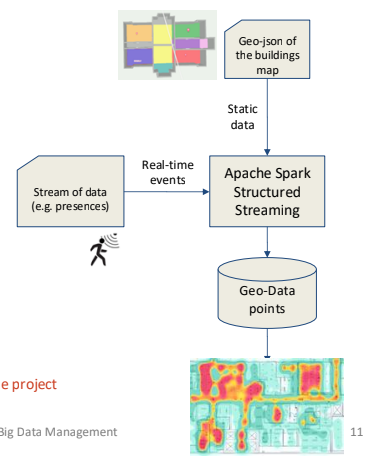

# Heat-map Analytics

This project develops an analytics pipeline to generate geo-located heat maps based on time-series IoT data.  
In the time series, you will find temporal data about IoT events, while the geolocation information is stored
separately.  
Our objective is to integrate these two sources, aggregate data over time windows, and produce a geo-heat map
visualization tool.



---

## Table of Contents

- [Prerequisites](#prerequisites)
    - [JDK 17 Installation](#jdk-17-installation)
    - [Conda Installation](#conda-installation)
- [Environment Setup](#environment-setup)
    - [Cloning the Repository](#cloning-the-repository)
    - [Creating/Updating the Conda Environment](#creatingupdating-the-conda-environment)
    - [Configuring MongoDB Connection Variables](#configuring-mongodb-connection-variables)
- [Running the Application](#running-the-application)
- [Additional Notes](#additional-notes)

---

## Prerequisites

### JDK 17 Installation

The project relies on Java-based components. To install JDK 17 or later:

1. Visit the official website of your preferred JDK distributor. For example, you can use:
    - [Oracle JDK 17 Downloads](https://www.oracle.com/java/technologies/javase/jdk17-archive-downloads.html)
2. Download and run the installer for your operating system.
3. Verify the installation by running:
   ```bash
   java --version
   ```
4. Ensure that the `JAVA_HOME` environment variable is correctly set to your JDK installation path.

### Conda Installation

If you do not have Conda installed:

1. Download and install [Anaconda](https://www.anaconda.com/download) by following the instructions on the website.
2. Confirm that Conda is added to your system's PATH or configure it manually.

---

## Environment Setup

### Cloning the Repository

Clone the project repository to your local machine:

```bash
git clone https://github.com/SamuelePirani/HeatMap---TBDM2425.git
cd HeatMap---TBDM2425
```

### Creating/Updating the Conda Environment

Use the provided `environment.yml` file to create (or update) the Conda environment with all necessary dependencies:

- **Creating the environment:**

  ```bash
  conda env create -f environment.yml
  ```

- **Updating an existing environment:**

  ```bash
  conda env update -f environment.yml --prune
  ```

### Configuring MongoDB Connection Variables

The project uses environment variables to configure the MongoDB connection. After creating or updating your Conda
environment, set the appropriate variables using the following commands:

```bash
conda env config vars set MONGO_PASSWORD="your_password"
conda env config vars set MONGO_USERNAME="your_username"
conda env config vars set MONGO_URL="your_url"
```

After setting these variables, it is important to deactivate and then reactivate your environment to apply the changes:

```bash
conda deactivate
conda activate heatmap-analytics
```

---

## Running the Application

With the environment activated and all dependencies installed, run the main application:

```bash
python main.py
```

---

## Additional Notes

- **IDE Configuration:** If you use an IDE like PyCharm, make sure its interpreter is set to the correct Conda
  environment. Some IDEs may not automatically import the environment variables set via Conda; in this case, configure
  them manually in the run configurations.
- **Troubleshooting:**  
  If you encounter errors related to MongoDB connection (e.g., "Invalid URI host: none is not a valid hostname"),
  double-check that all MongoDB-related variables (`MONGO_PASSWORD`, `MONGO_USERNAME`, `MONGO_URL`) are correctly
  configured and loaded in your environment.

Follow these guidelines to ensure that all required dependencies and configurations for data processing and analytics
are properly set. Enjoy exploring your new analytics pipeline!